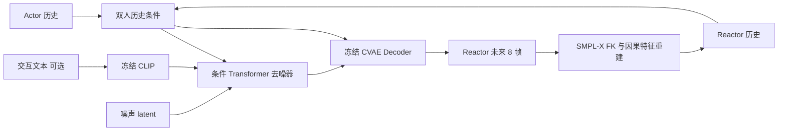

# MoReAct — Motion Reaction Generation

在 Inter-X 上从头训练的在线反应动作生成项目，基于 DART 的条件动作 VAE、latent diffusion 和分段自回归设计。输入 actor 已观测动作、reactor 历史和可选交互文本，仅预测 reactor 的未来动作。

动作理解与反应生成的当前结构见 [主架构文档](docs/ARCHITECTURE.md)：生成保留连续 latent；理解复用同一冻结 CVAE encoder 的确定性 `mu`，经 K=2 RVQ 和 T5 输出完整双人交互描述。

**已实现动作生成及离线整段理解的训练/推理入口。** 使用 `python -m moreact semantics --help` 查看缓存、RVQ、T5、描述与评估命令，完整流程见 [共享 CVAE/RVQ 使用规范](docs/SHARED_RVQ.md)。正式语义质量待训练验证；`ReactionSession` 和 `moreact react` 尚未实现，整段描述不作为在线生成条件。

本机资源绝对路径、权重配套关系及完整训练/恢复方法见 [资源与训练总览](docs/RESOURCE_AND_TRAINING_GUIDE.md)。

文档统一放在 [docs/](docs/README.md)。项目维护遵循 [维护规则](docs/MAINTENANCE.md)：临时实验写入独立 `tmp/` 目录，先将结论和必要证据归档到 `docs/reports/`，再删除无依赖的临时产物；正式数据和训练运行保留独立目录。



训练分两步：先训练双人历史条件 CVAE，再冻结完整 CVAE、训练预测 `z₀` 的扩散模型。所有动作权重随机初始化，CLIP 使用预训练权重。首版是身体动作生成，包含 root 和 21 个身体关节；手、脸保持中性。

## 环境与已有资产

本机已验证的环境：

```bash
cd /data/autovla/projects/MoReAct
export MOREACT_PYTHON=/data/users/autovla/.envs/remogen-motion-only/bin/python
"$MOREACT_PYTHON" -m moreact --help
"$MOREACT_PYTHON" -m pytest -q
```

该环境已有 PyTorch 2.1、SMPL-X、OpenAI CLIP、SciPy、PyYAML、Matplotlib、pytest。视频依赖系统 `ffmpeg`。也可在具备这些依赖的环境中执行 `pip install -e '.[text,test]'` 后使用 `moreact` 命令。不会修改 DART 或其他项目的源文件、数据和权重。

`configs/default.yaml` 配置原始数据、身体模型与 CLIP 权重路径；路径可在覆盖配置中修改，相对路径相对于项目根目录。默认复用外部资产：

- Inter-X 原始数据：`../interx_ardy_mvp/full_data`，包含 `motions/{episode}/P1.npz`、`P2.npz`、`texts.zip`、`splits`、`annots/interaction_order.pkl`。
- SMPL-X：`../remogen_official_release/smpl_models`，仅使用身体模型资产，不加载 ReMoGen 的动作模型或代码。
- CLIP：`/home/autovla/.cache/clip/ViT-B-32.pt`。

## 数据、人物方向与因果性

`prepare` 以原始 episode 为单位保留官方划分，拒绝 split 重叠和重复 ID。每段只产生一个 actor→reactor 样本：`order=0` 对应 P1→P2，`order=1` 对应 P2→P1。

`assets/role_overrides.json` 优先于文档规则，仅接受带动作复核证据的修正。目前 `G013T002A005R001`、`G056T001A005R001` 均设置 P1 为 actor。未经审核的角色记录为 `annotation_assumed`；几何候选、文本启发式结果不自动修改角色。原始交互描述整体用于 CLIP，不将 first/second person 字样强行映射为 P1/P2。

原始 120 FPS 同步按 4 倍下采样到 30 FPS，不做需要未来帧的插值或平滑。保留双方原始 gender、betas，统一从 Y-up 转换为 Z-up；旋转 SMPL 平移时考虑 shaped pelvis offset，保留共同地面与相对高度，不对两个人分别落地。

每人 276 维特征依次为：

| 字段 | 维度 | 定义 |
| --- | ---: | --- |
| transl | 3 | SMPL-X 平移 |
| poses_6d | 132 | root + 21 身体关节，PyTorch3D/DART 行向量 6D 约定 |
| transl_delta | 3 | 当前帧减前一帧 |
| global_orient_delta_6d | 6 | `R[t] @ R[t-1].T` |
| joints | 66 | SMPL-X FK 的前 22 个关节 |
| joints_delta | 66 | 当前帧减前一帧 |

序列第一帧位移/关节增量为零、旋转增量为单位旋转。切窗口时保留已观测前帧导出的因果增量。共同参考系来自 reactor 最后一个历史帧的骨盆水平位置和髋部朝向，地面高度保持不变。统计只从训练集窗口计算，checkpoint 绑定缓存 digest。

共享 mean/std 使用双方等权统计：每个窗口中 actor、reactor 都贡献 `history+future` 帧，采用同一个由 reactor 历史确定的坐标系。统计仅使用训练集，窗口 stride=1；训练样本起点 stride=1，primitive 内推进仍为 future=8。actor 未来仅参与离线总体统计，不作为模型条件。`stats.npz` 记录统计版本、双方帧数、权重及步长。恢复训练或加载 CVAE 训练 diffusion 时，会检查 checkpoint 与缓存的 mean/std 完全一致。

缓存包含分段 `.npz`、完整角色与 split manifest、预处理报告、训练集 mean/std、冻结 CLIP 的 caption embeddings。缓存设置发生变化时要求新的缓存目录；同配置重跑会检查源文件时间/大小、文本与角色信息，复用匹配样本。可用 `prepare --reuse-cache data/interx` 从旧缓存复用与窗口长度无关的 episode 特征：检查特征设置及每个样本的源摘要后写入新目录，重新计算统计，不修改旧缓存。无效样本及原因写入报告。`--limit` 是每个 split 的最大样本数，不能在完整缓存路径下混用小样本设置。

## 训练与生成

小样本链路（训练、验证、测试各 8 段，较小网络，各训练 200 步）：

```bash
bash scripts/smoke.sh
```

该脚本每次创建唯一临时目录；成功后将配置、指标和日志归档到 `docs/reports/`，再删除本次临时数据、权重和预览。失败时保留工作目录供排查。正式训练入口对已有 `last.pt` 仍要求显式 `--resume`。小样本权重只能验证工程链路，不代表收敛后的动作质量。

完整流程：

```bash
"$MOREACT_PYTHON" -m moreact prepare --device cuda:0
"$MOREACT_PYTHON" -m moreact train_vae --output runs/full/vae
"$MOREACT_PYTHON" -m moreact train_diffusion --vae runs/full/vae/last.pt --output runs/full/diffusion
"$MOREACT_PYTHON" -m moreact rollout --checkpoint runs/full/diffusion/last.pt --output outputs/example --frames 120
```

也可使用可恢复流水线，顺序执行全量准备、CVAE、重建评估、diffusion、消融评估和视频导出：

```bash
"$MOREACT_PYTHON" -u scripts/run_pipeline.py --device cuda:0
```

流水线独占 `runs/full/pipeline.lock` 防止重复启动；状态在 `runs/full/status.json`，各阶段日志在同目录。重新运行同一命令会复用数据并从 `last.pt` 恢复。失败时记录阶段及退出码，不把失败标成完成。

默认 CVAE 为 5 层 skip Transformer、隐藏维度 256、latent `1×128`；去噪器为 8 层、隐藏维度 512、4 个头的条件 Transformer，双方历史分别投影并加入角色/时间标识。它采用 DART 的 token 条件方式，不依赖 adaLN DiT 实现。

训练默认值：batch 128，AdamW（weight decay 0），学习率 `1e-4` 线性退火，梯度裁剪 1，EMA `0.999`。CVAE 使用 DART 风格的 Huber 特征重建、`1e-6 × KL`、SMPL-X 关节重建、显式关节/FK 一致性和三项增量一致性，并加入 reactor 骨长与 GT 接触掩码下的脚部速度损失；权重依次为 `1/1e-6/10/10/100/100/100/10/30`。CVAE 不使用 actor 几何重建、双人距离、双人接触或相对朝向损失。diffusion 默认使用 latent MSE；`configs/diffusion_geometry.yaml` 启用解码几何监督，当前配方不启用独立 `root_position`，使用 `smpl_joints_rec=20`、24 个 root 特征通道 5 倍权重及 GT 距离 <1.5 m 的 distance map，接触阈值仍为 0.10 m。配方还以 25% 概率给训练历史加入标准差 2 cm、最大 5 cm 的水平平移，并统一按实际历史重算所有样本的未来首帧增量；验证和推理不加噪声。可选的相对 root 位移与旋转监督用于 [rollout 漂移消融](docs/reports/20260927_rollout_root_reduction/README.md)。详见[扩散损失](docs/DIFFUSION_LOSSES.md)。历史实验配置保持原样。

该几何配方同时设置 `train.val_sampling: stratified_action`：每次验证覆盖所有
动作类别，类内随机抽序列和窗口，按训练步数换样本并保留复现清单；启动时
检查 train/val 序列无交集和类别覆盖。旧配置省略该字段时沿用顺序验证。

分布式训练支持 `--new-objective` 在新 run 中续训新的损失目标，以及
`--validate-at-start` 记录初始验证。可使用 `scripts/sync_diffusion_wandb.py --run RUN`
独立上传全部损失，配置及故障恢复方式见[分布式训练](docs/DISTRIBUTED_TRAINING.md)。

每阶段默认 300,000 个 optimizer step：前 100,000 步使用真实历史；之后 100,000 步线性提高生成历史概率；最后 100,000 步完全回填生成历史。每个样本包含 4 个连续 primitive，损失取平均后更新一次。diffusion 回填通过完整去噪采样产生，不读取未来 latent。SMPL-X FK 重建姿态对应关节及后向增量后再反馈。

扩散采用 10 步 cosine DDPM、`z₀` 预测。第二阶段从训练集估计 CVAE latent 标准差，只缩放不减均值；完整 CVAE 冻结。文本 dropout 0.1；`--no-text` 使用零 CLIP embedding；CFG 仅移除文本，始终保留动作历史，默认 `--guidance 1`。

恢复命令示例：

```bash
"$MOREACT_PYTHON" -m moreact train_vae --output runs/full/vae --resume runs/full/vae/last.pt
```

checkpoint 保存模型、EMA、optimizer、全套 RNG、归一化统计、配置、数据 digest 和步数；diffusion checkpoint 内嵌冻结 CVAE。`--steps` 表示绝对目标步数，不是额外步数。相同环境下 CPU 精确恢复已有测试覆盖；不保证跨硬件/版本位级一致。

生成示例：

```bash
"$MOREACT_PYTHON" -m moreact rollout \
  --checkpoint runs/full/diffusion/last.pt \
  --episode G006T001A005R002 --output outputs/reaction \
  --frames 120 --seed 0 --no-text
```

默认 primitive 与 DART 对齐为 `H=2, F=8`：使用双方 2 帧初始化历史，此后 reactor 历史完全来自生成。每生成 8 帧后更新 actor 条件，约每 0.267 秒更新一次；不做逐帧 refinement。`--start-frame` 是观测前缀起点，实际生成从 `start_frame + 2` 开始。最后不足 8 帧时裁切输出；请求超过片段长度时记录实际帧数。`H=2` 使用独立的 `data/interx_h2_f8` 缓存和训练集归一化统计，不与早期 `H=16` 实验混用。

输出 `motion.npz`（双人动作、参考真值及初始 reactor 历史）、独立 `actor_smplx.npz` / `reactor_smplx.npz` / `target_smplx.npz`、`metadata.json` 和 `preview.mp4`。独立 SMPL-X 文件使用 165 维 poses、trans、betas、gender，明确标为 Z-up。视频：蓝色 actor、橙色生成 reactor、灰色参考 reactor。

## 在线接口

当前在线生成接口为下述 `ReactionGenerator`。统一闭环将由 [架构文档](docs/ARCHITECTURE.md) 中的 `ReactionSession` 调用该接口，并单独管理语义历史、异步计划和动作提交。

`moreact.generate.ReactionGenerator.initialize()` 接收 `[B,H,276]` 的 reactor 历史和双方 body 参数，返回 `ReactionState`。`step(actor_history, state, text_embedding=None)` 接收当前 actor 历史，返回 `[B,F,276]` 世界坐标动作与新 state；接口没有 actor/reactor future 参数。

body 参数中 `betas` 为 `[B,2,10]`，`genders` 为 `[B,2]`（male=0/female=1/neutral=2），`offsets` 为 `[B,2,3]`；人物维顺序为 actor、reactor。text embedding 为 `[B,512]`。所有输入 motion 必须采用本文定义的因果 276 维表示，不可直接传入旧 DART 的前向差分缓存。

当前 `rollout` 是离线回放入口：默认读取数据集参考 caption；`--text` 使用指定的固定文本，`--no-text` 使用零文本条件。它尚不从动作在线推断语义。未来 `react` 入口只读取姿态和身体信息，在片段边界应用预测文本；两种评估口径分别记录。

## 评估和限制

```bash
"$MOREACT_PYTHON" -m moreact evaluate --checkpoint runs/full/vae/last.pt --output outputs/vae_eval --split val
"$MOREACT_PYTHON" -m moreact evaluate --checkpoint runs/full/diffusion/last.pt --output outputs/reaction_eval --split val
```

VAE 评估是使用真实未来与 posterior mean 的重建；diffusion 是从初始历史开始的完整自回归采样。两者不能混称生成指标。

默认 diffusion 评估比较有/无文本 × 正常/逆序/移除 actor 历史六组，采用相同随机种子。逆序仅操作已观测帧，移除操作作用于归一化 actor 特征。报告相对正常条件的输出变化，但变化本身不代表条件使用正确。

报告世界/根对齐关节误差、root ADE/FDE、双人根距离误差、最近关节距离、脚滑、段间速度跳变和 jerk。脚滑统计以预测脚部低于原始地面 8cm 为接触代理，无接触返回 null；最近关节距离不是网格碰撞或接触准确率。延迟包含去噪、解码与 FK，排除加载、文本编码、渲染和文件 IO，不据此自动宣称实时。

首版不包含机器人重定向、手指、全库角色重标注或 ReMoGen FWSR。原始角色和共同地面标注的残余错误需保留在实验报告中。完整数据上尚未收敛之前，不应将 smoke 生成视频作为质量结论。

架构来源与许可证见 [NOTICE.md](NOTICE.md)。运行验证记录见 [VALIDATION.md](docs/VALIDATION.md)。

残差语义分支的正式训练配方、状态位置和 bridge 比较协议见
[2026-09-26 训练记录](docs/reports/20260926_semantics_training/README.md)。文本训练支持梯度检查点与梯度累积。
