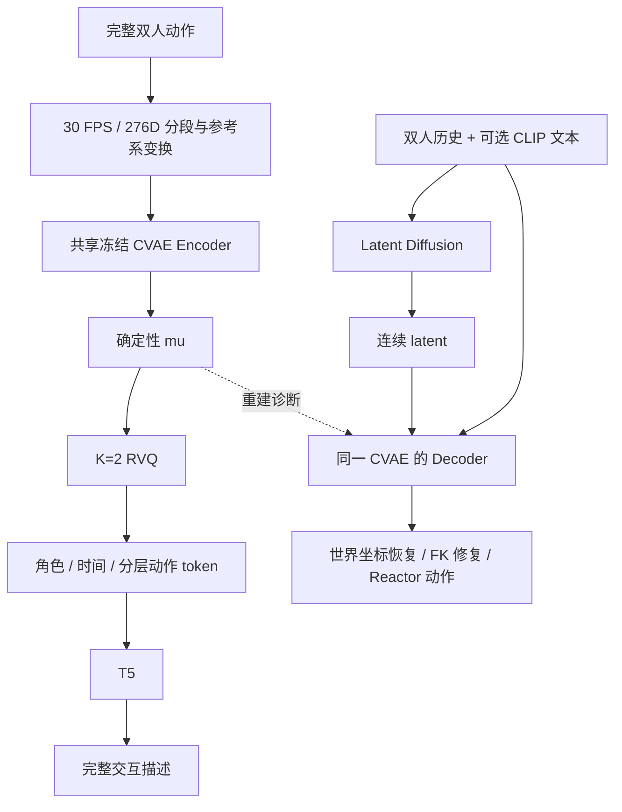

# MoReAct 当前架构

MoReAct 使用同一套 CVAE 权重支持连续反应生成和离线整段动作理解。
**生成使用连续 latent，理解在冻结 encoder 的 `mu` 上加 K=2 RVQ，再由 T5 描述双人交互。**
完整命令和资产约定见 [共享 RVQ 规范](SHARED_RVQ.md)，工程验证见 [验证报告](reports/20260926_shared_rvq/README.md)。

## 能力状态

| 能力 | 状态 |
| --- | --- |
| 条件 CVAE、latent diffusion、30 FPS 分段生成 | 已实现，保留原接口和连续解码路径 |
| 共享冻结 CVAE 的确定性双方向编码 | 已实现，可加载 checkpoint 或直接引用生成器的 VAE 实例 |
| K=2 EMA RVQ、latent/token 缓存与身份检查 | 已实现，码本只读取 train latent 更新 |
| T5 训练/恢复、整段描述、消融及重建诊断 | 已实现，T5 为可选依赖 |
| 正式训练后的理解质量 | 待正式训练和评估；工程 smoke 不能替代质量验证 |
| 在线语义调度、ReactionSession、react 命令 | 未实现；当前描述不作为在线生成条件 |

## 数据流

理解只需要 encoder；生成推理主要使用 decoder，生成训练使用 encoder 构造监督 latent。
“共享”指同一 CVAE 参数及特征/归一化契约，不要求推理时两个分支都调用完整 encoder-decoder。
量化解码只做诊断，不进入生产生成路径；文本描述也不回灌当前生成。

## 模块与依赖

| 模块 | 职责 |
| --- | --- |
| `data.py` / `geometry.py` | 角色、Inter-X 数据、276D 因果特征、训练统计、坐标变换和 SMPL-X FK |
| `models.py` / `diffusion.py` | CVAE、条件去噪器与连续 latent 扩散；`encode_mean` 不抽样 |
| `train.py` / `train_distributed.py` / `losses.py` | 生成模型训练、DDP、历史回填、动作及几何损失 |
| `generate.py` / `text.py` | `ReactionGenerator`、分段回放、冻结 CLIP |
| `semantics/tokenizer.py` | 引用冻结 CVAE；按双方目标方向构造历史、参考系和均值 latent |
| `semantics/rvq.py` / `cache.py` | 独立残差量化、EMA 拟合/恢复和版本化缓存 |
| `semantics/language.py` | T5 词表对齐、长度审计、训练/恢复、描述与文本消融评估 |
| `semantics/diagnostics.py` | 双方向连续/量化重建的 FK、根轨迹及运动指标 |
| `semantics/common.py` / `cli.py` | 身份校验、缓存校验和理解命令 |
| `evaluate.py` / `render.py` | 原生成评估和可视化 |

生成模块不导入 T5；语义包导入时不加载 transformers。运行不导入 `ttr_remogen`，
不依赖 bridge 源码或其 10 FPS/274D 特征分支。迁入的量化算法来源见 [NOTICE](../NOTICE.md)。

训练可通过独立 `scripts/sync_diffusion_wandb.py` 上传 rank-zero 的持久化 JSONL，
上传故障不进入 DDP 同步路径。支持训练/真实历史验证/生成历史验证的全部原始与
加权损失。显式 `--new-objective` 支持在新目录中从已有权重和优化器切换损失，
重置 best 标量；普通 resume 保留严格目标一致性检查。

## 接口与契约

- 原 `ReactionGenerator.initialize()`、`step(..., text_embedding)`、`ReactionVAE.encode/decode` 保持兼容。
- 新 `ReactionVAE.encode_mean(actor_history, reactor_history, target)` 在 eval 模式返回 `mu`，不改变 RNG。
- `SharedMotionTokenizer.from_generator(generator)` 直接引用 `generator.vae`；独立入口加载指定 diffusion checkpoint 的内嵌 VAE。
- `encode_pair(features, betas, genders, offsets)` 输入 `[2,T,276]` 世界因果特征，返回 `[窗口,2,128]` latent 和窗口元信息。
- `InteractionCaptioner.describe(...)` 只接收动作与身体参数，输出完整交互文本、有效性、长度和资产身份。

每个 primitive 沿用 H=2/F=8。编码 actor 时交换条件槽、目标槽及身体偏移，以 actor 历史建立参考系；
编码 reactor 时沿用原方向。当前 CVAE 只训练过 reactor 目标，因此 actor 方向属于待质量验证的迁移使用。
完整动作最后不足 F 帧使用重叠尾窗，记录新增帧数，不填充虚假动作。

CVAE 权重/缓冲、归一化、数据 digest、H/F/FPS、RVQ 状态和 T5 词表均绑定身份。
首次提取保存独立 `vae_snapshot.pt`；后续复用快照，禁止随活跃 `last.pt` 更新。
现有 decoder 的 latent scale 不用于理解量化，也不会被理解训练重新估计。

## 训练与评估边界

生成 diffusion 可配置解码几何监督。当前配方已移除独立 `root_position`，
其物理米制平移 MSE 实现仅保留供历史配置复现。定义、权重和恢复边界见
[扩散损失](DIFFUSION_LOSSES.md)。这些损失不改变生成输入或冻结 CVAE 的参数。

当前几何配方使用 `smpl_joints_rec=20`，归一化特征中的 24 个 root 通道内部
加权 5 倍，`distance_map` 按 GT 距离 <1.5 m 筛选，接触阈值仍为 0.10 m。
`augmentation.py` 提供仅用于 diffusion 训练的历史水平刚体平移：概率 0.25、
标准差 2 cm、长度上限 5 cm。新配方启用 `recompute_target_deltas`，所有样本
（包括无噪声生成历史和 rollout 验证）的未来首帧增量均按实际输入历史重算，
未来位置仍为原 GT。验证、推理和 CVAE 训练不注入噪声。相关新配置缺省时
保留旧行为，普通恢复拒绝改变 `diffusion_loss_options` / `history_augmentation`。

单卡与 DDP 共用 `learning_rate_at`，支持 `lr_schedule_start_step`，起点前保持
基础学习率。两种训练入口均支持 `validate_rollout` 与 `best_rollout.pt`，验证
保存并恢复训练 RNG；更换目标或验证采样口径会重置两个 best 指标。
DDP 在新运行目录通过 `--stage2` 更换全局 batch 时也重置 best 指标，因为
验证窗口数量随之变化；模型、EMA 与优化器仍从来源 checkpoint 恢复。

`train.val_sampling: stratified_action` 启用按 Inter-X episode 的 Axxx 动作类别
均衡分层验证。启动时检查 train/val episode 无交集、可用类别一致；每次验证
按 seed+9001+step 重新抽样，类内随机轮换 episode 再抽时间窗口，DDP 各 rank
切分同一全局列表。抽样清单保存在 `validation_samples/step_*.json`。
切换验证口径时重置 best 标量，旧 checkpoint 分数不参与新口径最优值比较。
未设置该键的旧配置仍保持 sequential 行为，已有进程需重启才能应用变更。

顺序为固定 CVAE → 缓存双方 mu → train-only EMA 拟合 RVQ → 冻结并缓存 token → T5 整段描述训练。
T5 trainer 只加载离散缓存及语言模型，无法更新 CVAE 或 RVQ。监督是完整交互 caption，模型不读取 caption 作为动作输入。

理解评估包含正常输入、打乱时间组、移除 actor、移除 reactor、移除第二层码。
最后一项是 K=2 模型的消融，公平 K=1 对照需要另训 K=1 RVQ 和 T5。
词级 F1/ROUGE-L 是代理指标，角色、动作和先后关系错误需人工审核样例。
重建诊断使用真实历史，不等于自回归生成质量。

工程报告和临时文件遵循 [维护规则](MAINTENANCE.md)。早期在线语义闭环设计已归档至
[历史设计](history/ONLINE_SEMANTICS_DESIGN.md)，不是当前运行能力。
