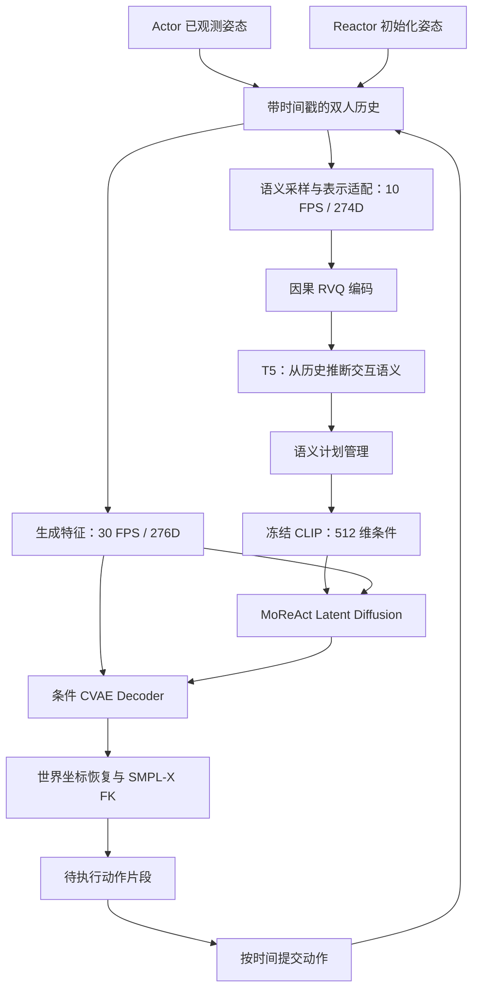
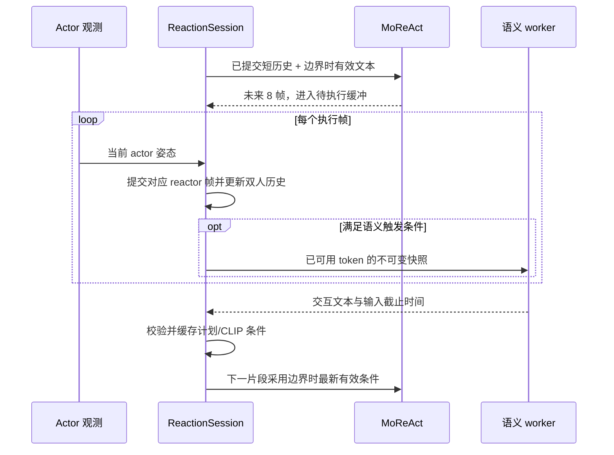

> 历史设计：本文件保留早期独立语义编码器与在线闭环设想。当前实现以 [主架构](../ARCHITECTURE.md) 和 [共享 RVQ 规范](../SHARED_RVQ.md) 为准。

# MoReAct：动作理解与反应生成统一架构

状态：**架构设计已落文，语义代码迁移、在线会话实现及模型验证待实施。**
本文规定目标模块、接口和验收标准，不表示闭环已经接通。当前可运行能力见
[README](../../README.md)，已有运行验证见 [VALIDATION.md](../VALIDATION.md)。

维护规范见 [MAINTENANCE.md](../MAINTENANCE.md)。将生成 CVAE 与语义 tokenizer 统一为两级 RVQ 的
候选路线见 [共享 RVQ 讨论](../SHARED_RVQ.md)，尚未替换本文的独立语义编码器基线。

## 1. 目标与当前能力

以 MoReAct 为单一主工程，将 `ttr_remogen_bridge` 中语义推理所需的能力迁入，形成
“观测动作 → 理解交互 → 文本条件 → 反应生成 → 已执行动作反馈”的在线闭环。
第一版使用动作 token → T5 → 整体交互文本 → 冻结 CLIP → MoReAct，沿用现有动作模型接口。

| 能力 | 当前状态 | 目标 |
| --- | --- | --- |
| 因果动作生成 | 已有 `ReactionGenerator`、CVAE、latent diffusion 与 FK | 继续承担生成职责 |
| 文本条件 | 已有 `FrozenCLIP` 和 `[B,512]` 条件输入 | 接收在线推断的交互文本 |
| 语义特征、RVQ、T5 | bridge 中有多个版本，尚未迁入 | 独立语义模块，绑定明确的资产契约 |
| 在线语义调度与动作提交 | MoReAct 尚无统一会话 | 异步推理，片段边界换条件，逐帧提交反馈 |
| 在线语义质量与实时性 | 尚未在 MoReAct 闭环中验证 | 通过独立的工程及质量验收 |

本次交付为本文及 README 入口说明。后续才实施代码迁移、前缀适配训练和完整运行验证；
不改变现有训练、生成命令或模型权重，不启动训练。

## 2. 数据流、模块及迁移边界

当前代码已经实现的模块分工如下：

| 模块 | 当前职责 |
| --- | --- |
| `data.py` / `geometry.py` | Inter-X 准备、角色、30 FPS 因果特征、训练统计、参考系变换与 SMPL-X FK |
| `models.py` / `diffusion.py` | 条件 CVAE、历史/文本条件去噪器、latent 采样 |
| `train.py` / `train_distributed.py` / `losses.py` | CVAE 与 diffusion 分阶段训练、DDP、生成历史回填和损失 |
| `text.py` | 冻结 CLIP 编码，当前输入为指定文本或数据集 caption |
| `generate.py` | 流式生成接口、分段自回归回放与 SMPL-X 导出 |
| `evaluate.py` / `render.py` | 重建/生成评估、条件消融和可视化 |
| `cli.py` / `config.py` | 命令入口、配置合并、校验及路径解析 |

下图为包含待迁移语义能力的目标结构。

以下目录是拟新增的模块边界，当前尚不存在：

| 所属模块 | 职责与依赖方向 |
| --- | --- |
| `moreact/semantics/` | 姿态适配、语义特征、流式 RVQ、词表和 T5 推理；不调用动作生成器 |
| `moreact/runtime/` | 观测与已提交历史、语义快照、计划调度、CLIP 缓存、待执行片段、会话及事件日志 |
| 现有生成、几何、文本模块 | 保持 `ReactionGenerator`、SMPL-X FK、`FrozenCLIP` 的职责；不反向依赖会话或 T5 |

运行模块组合语义后端与动作生成器。模块间传递带时间和来源信息的姿态、token、计划及片段，
不共享可被工作线程修改的历史数组。语义与生成设备分别配置，第一版采用单会话、进程内单语义 worker。
线程异步不等于 GPU 计算隔离，同卡竞争计入延迟测量。

迁移最小依赖闭包：特征转换及归一化、因果 RVQ 编码、词表/模型加载、推理、必要的数据契约和相关测试。
将推理加载从训练工具中拆开，不为复用加载函数而迁入训练器和实验脚本。
保留来源记录、必要的 TTR 上游许可证，并在实际迁移时更新 [NOTICE.md](../../NOTICE.md)。
ReMoGen 生成器、FWSR、vendor 中的生成依赖和历史实验脚本不进入新运行链路。

迁移后的运行不导入 `ttr_remogen`，不修改 `sys.path`，不要求 bridge 源码目录存在。
权重、词表、身体模型和归一化文件由配置指定，可以位于外部资产目录；基础生成安装不强制加载语义依赖。

## 3. 表示与资产契约

### 共享姿态，分别构建特征

公共历史使用米制、Z-up 世界坐标，保存平移、root/body 旋转、身体参数和角色。
actor/reactor 身份在会话内固定；保留双方 gender、betas、骨盆偏移及共同地面。
生成后通过 FK 修复的姿态是反馈事实，网络预测的关节和差分不能替代该事实。

| 项目 | 生成分支 | 语义分支设计基线 |
| --- | --- | --- |
| 采样率 | 30 FPS | 10 FPS |
| 特征 | MoReAct 276D | `pair_relative_v2` 274D |
| 差分 | 当前帧减前帧 | 当前帧到下一帧，等待支撑帧到达后释放 |
| 归一化 | 生成 checkpoint 的 mean/std | 与 RVQ 绑定的独立 mean/std |
| 身体与参考系 | 保留体型，生成窗口使用 reactor 历史确定的参考系 | 按语义资产契约适配身体、地面和参考系 |
| 输出 | 每次生成 8 帧 | 每 4 个特征帧一组 token，双层 RVQ |

不得把 MoReAct 276D 数组直接送入 bridge 编码器，也不得仅改采样率标签或复用生成归一化。
语义分支先从姿态按固定相位取每三帧，再计算 10 FPS 特征和差分，不对 30 FPS 差分简单抽样。
相位锚定会话首个初始化帧；跨生成片段不重置采样或 RVQ 状态。
第一版要求连续同步输入；时间戳缺口、倒序和角色错位显式报错，不用未来插值补齐。

若语义权重要求 neutral/zero-beta，转换时保持世界骨盆轨迹，按目标模板偏移重算 SMPL 平移及 FK。
地面偏移、初始化参考系、模板和骨盆补偿严格按所选资产契约复现，仅影响语义分支。
不能用整段最低点计算在线地面，也不能假设所有 bridge 实验采用同一套落地策略。

每个特征和 token 分别携带动作时间及 `available_at`。例如 10 FPS 姿态的前向差分
`pose(t+0.1)-pose(t)` 最早在 `t+0.1` 可用；token 的可用时间包含其全部支撑帧。
只释放完整 RVQ 时间组，两个 level 不拆开；缺少尾部支撑帧时不补未来帧。
语义窗口只裁剪已经生成的 token 历史，不能每次重新初始化因果编码器。

### 加载时必须绑定的资产

| 资产 | 契约内容 |
| --- | --- |
| MoReAct diffusion checkpoint | 配置、CVAE、统计、数据身份、FPS、H/F 和 CLIP 身份 |
| RVQ | checkpoint SHA256、特征版本和维数、FPS、时间步长、level 数、码本大小、精度约定 |
| 语义表示 | 归一化 SHA256、身体模板身份、体型转换、地面与参考系规则、骨盆补偿 |
| T5 与 tokenizer | checkpoint/词表身份、RVQ SHA256、level 到符号的映射、任务/prompt 版本、输入输出长度限制 |

设计基线为双层 RVQ、每层 256 个码，序列化按时间组内 level 0、level 1 排列；
level 1 使用独立符号区间。具体权重必须验证这些契约，不能只凭文件名或张量形状判断兼容。
旧资产缺少元数据时须先提供可核验的资产说明；不猜测默认值，不因不匹配而静默降级为无语义运行。
保持已有 checkpoint 格式兼容，新增契约可由独立资产清单承载。

现有 Stage 2 使用完整 actor 动作，历史 pair-relative actor token 还含同期 reactor 信息。
它可作为初始化或实验基线，尚不能作为已验证的在线规划器。目标任务输入是截至当前时刻的
双人历史，输出是推断的交互意图；整段 caption 不等于当前动作阶段的准确标注。
后续需要从姿态前缀重建输入并评估，必要时进行前缀和生成历史适配训练，保持原 episode split。

## 4. 公共接口与在线时序

以下为拟实现接口，不是当前可导入 API。

| 接口或对象 | 最小语义 |
| --- | --- |
| `MotionObservation` | 时间戳、角色、世界姿态、gender/betas/offset，以及 observed、seed 或 committed 来源 |
| `SemanticBackend.observe(...)` | 接收时间对齐的双方历史增量，更新语义采样、特征及 RVQ 状态，不执行 T5 生成 |
| `SemanticSnapshot` | 不可变的双人 token 窗口、支撑帧截止时间、会话/请求 ID、资产身份 |
| `SemanticBackend.infer(snapshot)` | 在 worker 中推断整体交互文本，返回有效结果或带原因的失败结果 |
| `SemanticPlan` | 会话/请求 ID、`observation_end`、交互文本、生成时间、有效状态、模型身份；可选 reactor 预期动作描述 |
| `ReactionSession` | 初始化、接收 actor 观测、生成片段、提交帧、重置和关闭；管理全部时序与事件 |

保留 `ReactionGenerator.initialize(reactor_history, betas, genders, offsets)` 和
`step(actor_history, state, text_embedding=None)` 的兼容性：历史为 `[B,H,276]`，
输出为 `[B,F,276]`，文本为 `[B,512]`。首版会话使用 B=1，底层生成器仍保留批量接口。

默认对 `SemanticPlan` 的整体交互文本编码，与 MoReAct 的交互文本训练条件一致；
可选 reactor 描述仅作解释输出，不拼接或自动替换主条件。
使用现有 `FrozenCLIP` 的数值约定，缓存按 CLIP 资产身份和文本索引，不额外归一化 embedding。
无语义时传 `None`，沿用零向量条件。

### 会话推进

1. 用双方 H=2 帧已知姿态初始化，建立生成状态、语义状态和会话时钟。尚无有效计划时使用零文本条件。
2. 生成下一片段时，只使用前一提交截止时间以内的双方历史，选择已返回且有效的最新计划。
3. `step()` 输出 F=8 帧后，先保存为待执行片段，固定该片段的 plan ID 和 embedding。
4. 随时间到达，接收对应 actor 观测并提交 reactor 当前帧；两者对齐后才进入语义历史。
5. 有完整双人 token 后首次触发语义推理，此后按 0.8 秒间隔创建最近 8 秒的快照。
6. worker 返回结果后校验会话、请求顺序、输出完整性和年龄；新条件只在下一片段开始时生效。

**生成状态与提交状态必须分开。** 当前 `step()` 返回的新 `ReactionState` 已包含预测片段末尾的历史。
会话将其保留到片段全部提交后再用于下一次生成；语义后端只能看到独立的已提交姿态缓冲。
最后不足 F 帧时只提交实际需要的帧。重置或提前结束时丢弃未提交预测，不能将它写入反馈 token。

### 调度、时间和失败处理

worker 最多一个任务执行中、一个最新待处理快照；新触发覆盖待处理项，不能无限排队。
RVQ 状态由观测侧串行更新，T5 只读快照。T5 不阻塞动作推进；CLIP 编码延迟单独记录。

计划年龄为 `now - observation_end`，默认最大 1.6 秒。
`observation_end` 是模型输入实际使用的最新支撑帧时间，不是发请求时间，也不能用更晚但未进入 token 的观测刷新。
使用会话相对时间计算年龄；墙钟生成时间只用于耗时统计，不能与动作时间直接相减。
实时回放的 `now` 同时反映播放时间和计算落后，离线快进使用逻辑时间并明确标记为非实时测量。

无效、未完整结束、过期、旧会话或旧请求的结果不覆盖有效计划；推理异常记录原因，旧计划保留至过期。
计划在片段中途过期时不改变当前去噪或执行片段，下一边界切换为空文本。
会话重置清空历史、采样相位、编码状态、待执行片段及计划，旧 worker 返回结果按会话 ID 丢弃。
关闭时不再接收新任务，释放 worker；日志保留失败和未应用结果。

### 入口与记录

后续统一入口采用 `ReactionSession`，CLI 拟新增 `moreact react --config <session-config> --output <dir>`，
由配置提供生成/语义资产、设备、观测源及调度参数。**该命令尚未实现，当前不可运行。**
首个观测源为现有缓存的按帧回放；会话只接收姿态与身体信息，不接收 caption 或 reactor 真值未来。

现有 `rollout` 保留为离线基线：默认读取参考 caption，`--text` 使用固定指定文本，`--no-text` 使用零条件。
在线模式需要独立的数据读取路径，不能先调用默认 `rollout` 再替换其文本。

未来闭环输出复用动作导出约定，增加语义触发、返回、生效、过期和失败事件，以及逐帧提交时间。
记录会话/请求/片段 ID、模型与词表/统计身份、原始输出、输入截止时间、执行模式和随机种子。
分别报告 RVQ、T5、CLIP、动作生成/FK 的耗时，以及语义从输入可用到实际生效的延迟和计划覆盖率。
现有仅测生成/FK 的延迟不能用作完整闭环实时性结论。

## 5. 实施顺序与验收

后续实施依次完成：语义最小迁移及资产加载、姿态适配与流式一致性、独立会话与提交缓冲、
统一回放入口和日志、真实资产闭环评估。前缀训练在输入契约和因果性验收后单独开展。

| 验收项 | 场景 | 通过条件 |
| --- | --- | --- |
| 因果性 | 删除/污染截止时间之后的 actor/reactor；更改未提交片段；同前缀不同未来 | 截止点以前特征、token 和语义输入一致，无未来访问 |
| 采样与差分 | 输入按不同 chunk 切分，跨 8 帧片段及 3 帧采样周期，尾部缺支撑帧 | 固定相位不漂移，前向差分仅在支撑帧到达后释放 |
| 表示一致性 | 同姿态前缀分别整段和增量转换，包括不同体型、旋转和平移 | FP32 特征在规定数值容差内一致，同环境 token ID 一致，公共姿态未被改写 |
| 资产契约 | 更换 normalizer、模板、RVQ、tokenizer 或任务配置 | 不匹配在启动阶段明确失败 |
| 调度 | 可控时钟模拟慢推理、异常、无效输出、过期和重置 | 请求数量有界，旧结果被拒绝，条件仅在边界更新，失败不替换有效旧计划 |
| 提交隔离 | 生成整段后逐帧推进，提前停止、尾段裁切 | 语义输入不含未提交预测，终止后不存在伪反馈 |
| 生成兼容 | 关闭语义，同样的观测、种子、权重和初始化 | 同环境生成结果与原无文本路径一致 |
| 独立部署 | 仅安装 MoReAct 与所需依赖，用配置指定资产 | 无 bridge 源码目录及 `PYTHONPATH` 依赖 |
| 闭环质量 | 同样本/种子比较无文本、在线预测文本、离线参考文本 | 分别报告动作质量、语义表现和端到端延迟；不把输出变化等同改善 |

单元验证使用可控 worker 和时钟；真实 RVQ/T5、CLIP 与 SMPL-X 集成验证另行标明所需资产。
真实质量评估报告世界/根对齐误差、root ADE/FDE、双人几何、脚滑、段间连续性及语义样本审查。
整段 caption 对前缀推断的指标只作意图代理，不能宣称已验证阶段级识别。

工程接通、模型适配和质量提升分开验收。当前文档不预设质量提升比例或实时达标结论；
只有实际评估记录能够将状态表中的待验证项更新为已验证。

## 6. 设计依据

本次按本地实现核对：MoReAct 的 `generate.py`、`text.py`、`cli.py` 和默认配置；
bridge 的 `data/features_v2.py`、`semantic/vq.py`、`runtime/scheduler.py`、
`semantic/interaction_stage2.py` 及 V5 RVQ、Stage 2、地面策略文档。
这些是设计来源记录，不构成迁移后的运行依赖。
bridge 存在多个训练/推理版本，旧 `Reaction: ... Actor: ...` 输出协议不直接作为本架构的整体交互文本协议。
