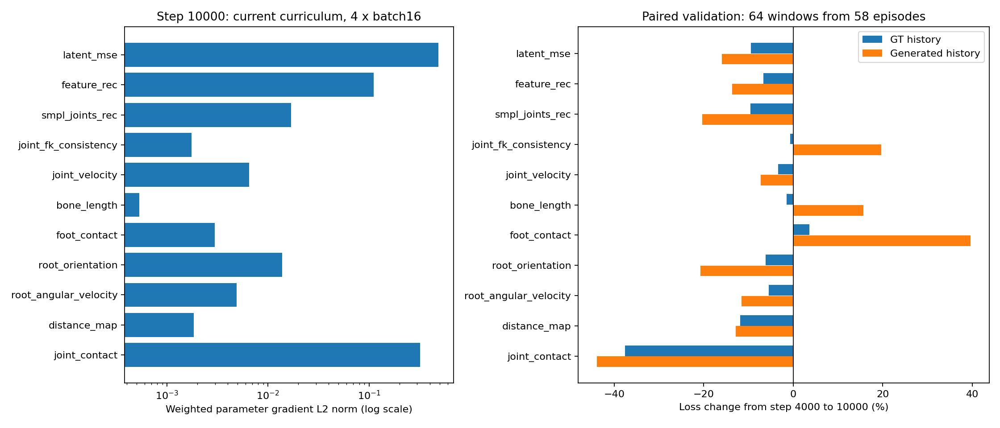

# Batch512 diffusion 各项损失审计

2026-09-26。仅诊断，没有修改当前 batch512 训练、权重或优化器。

## 已停止的旧任务

按用户指令向旧 `diffusion_geometry_ddp_20260925_152817` 的 torchrun launcher
PID 2005004 发送 SIGTERM；四个 worker 2005075–2005078 和 watcher 1966714
均已退出。其他训练未停止。停止时最后日志 step 109800；可恢复 `last.pt` 为
step 109000，最后约 800 个已记录更新未进入 last checkpoint。
现有 checkpoint 全部保留。watcher 将非零退出记为 failed，已附原始退出码将
状态注明 stopped_by_user。证据见 [old_run_stop.json](evidence/old_run_stop.json)。

## 方法与范围

当前任务是 GPU 0–3 的 `diffusion_stage2_b512_20260926_084433`。
使用不可变 step 4000 和 10000 checkpoint；SHA256 在
[checkpoint_hashes.json](evidence/checkpoint_hashes.json)。
`root_position=30` 只存在于后续配方，**当前任务没有此项**。

1. 日志趋势：stage2 的 step 3250–10000，原有每 250 step 验证。
2. 梯度：step 10000 的非 EMA 训练权重，train 模式（包含 dropout），64 个
   固定随机训练窗口，4 个 batch，每批 16；每窗口按原实现计算 4 个 primitive。
   分别测试 GT history、当前 p=0.28 的 curriculum、完全生成历史。
   每项 weighted loss 对全 denoiser 参数单独求导，再检查与总损失梯度之和相等。
3. 配对泛化探针：64 个固定随机 val 窗口覆盖 **58 条序列**，使用两个 checkpoint
   的 EMA、同一 VAE 和归一化、固定随机种子，分别比较真实/生成历史的损失。
4. VAE 参考：相同验证窗口，GT-history posterior-mean 重建的几何损失。
   这是可达到的参考残差，不是数学上的误差下界。

现有正式验证仅枚举验证集前 512 个窗口，覆盖 **5 条序列**（验证集共有 570 条
符合窗口长度的序列、82081 个窗口）。连续 stride=1 窗口高度重叠，不能把原有
val 曲线视作整个验证集趋势；本报告额外随机探针也不能代替完整评估。

## 各项结果

梯度列是当前 curriculum 下 4 个 batch 的加权参数梯度范数均值，**不是梯度占比**。
变化列为固定探针 step4000→10000 的 raw loss 相对变化；负数表示下降。

| 项 | 权重 | 梯度范数 | GT-history 变化 | generated-history 变化 | 解释 |
| --- | ---: | ---: | ---: | ---: | --- |
| latent_mse | 1 | 0.4884 | -9.4% | -15.9% | 强优化信号，主目标改善 |
| feature_rec | 1 | 0.1109 | -6.7% | -13.7% | 强优化信号，重建改善 |
| smpl_joints_rec | 10 | 0.0170 | -9.6% | -20.4% | 有效几何信号，改善 |
| joint_fk_consistency | 10 | 0.00175 | -0.7% | +19.7% | 信号弱，GT 下接近 VAE 参考；反馈下恶化 |
| joint_velocity | 100 | 0.00654 | -3.4% | -7.3% | 信号存在，改善较小 |
| bone_length | 10 | 0.000535 | -1.4% | +15.7% | 信号很弱，GT 下接近 VAE 参考 |
| foot_contact | 30 | 0.00297 | +3.6% | +39.6% | 有梯度，但探针未显示改善 |
| root_orientation | 1 | 0.0138 | -6.2% | -20.7% | 朝向改善，不等于 root 平移改善 |
| root_angular_velocity | 10 | 0.00492 | -5.5% | -11.6% | 有信号，旋转变化改善 |
| distance_map | 1 | 0.00184 | -11.8% | -12.9% | 数值改善，直接梯度较弱 |
| joint_contact | 10 | 0.3218 | -37.6% | -43.9% | 稀疏但可很强的交互监督 |

所有项在全部 12 个梯度探针 batch 中均有非零有限梯度；最大梯度求和校验误差
`2.79e-08`。没有证据表明有一项未接入或发生断梯度。
总配对 teacher loss 从 0.14852 降至 0.13484，generated-history loss 从
0.55221 降至 0.44841。后者仍只是四个 primitive 内的监督损失，不能替代
前一报告的整段生成 root ADE。



### 接触项的数值大小会误导判断

joint_contact 的梯度范数在 4 个 curriculum batch 中为 0.00288–0.79186，
均值 0.32185；并非每个 batch 都强。它是稀疏 contact-element mean，
采样组成会明显改变强度。在这组探针中它和 latent 梯度的平均 cosine 约 0.034，
说明其方向与 latent 并不高度重合。不能用 4 个 batch16 的数值直接替代
真实 global batch512 经 DDP 全局接触计数归一化后的梯度贡献。

### 骨长与 FK 一致性更接近弱正则项

相同 GT-history 验证窗口中，diffusion/VAE-reference 的 bone_length 残差比
约 **1.02**，joint_fk_consistency 比约 **1.04**。它们没有很大新增误差需要修正，
不能简单把“不下降”判定为实现失效。与此同时，生成历史组仍会恶化，
不能声称其已经解决长期几何稳定性。

VAE 已冻结，这些约束只能经 decoder 改变 latent 选择；生成反馈时 repair 又会
用 FK 覆盖直接预测的关节通道。bone_length/foot_contact 主要施加于直接关节，
与最终展示的 FK 关节并非完全同一个信号。

### 脚接触需要重新核对目标定义

当前 foot_contact 在 GT 掩码里惩罚预测脚部位移趋向 0，并不直接匹配 GT 速度，
也没有单独惩罚脚高度或 mesh 穿透。GT 掩码的位移阈值是平方范数 `<0.001`，
在 30 FPS 下对应约 0.95 m/s 的速度上限（还需满足高度阈值）。

相同窗口直接把 **GT 当预测**，该损失仍为 `6.917e-06`；VAE reference 为
`5.670e-06`，当前 diffusion teacher 为 `6.672e-06`。因此不能把它的非零残差
全部解释成模型生成滑步，也不能默认越强越好。完整序列滑步、FK 脚速度和
接触掩码质量应一并评估；优先检查定义，再决定是否调高权重。

## 可以与不可以下的结论

- 当前 11 项都有计算和梯度作用；latent、feature、接触为主要信号来源。
- SMPL 关节、朝向、速度、距离图等显示改善，但下降不证明是该项自身独立造成。
- 骨长/FK 项有梯度但很弱、接近 VAE 参考；脚接触在固定探针上没有改善。
- 缺少单独 root 平移监督仍属实；root orientation 不能代替 root position。
- 确认每个损失的**因果收益**需要同起点、同采样、同预算的留一项训练消融，
  这里没有执行长时间消融，也没有更改正在运行的 batch512 任务。
- 优先开展 root_position=30 对照，并检查 foot_contact 目标与 FK 输出一致性；
  当前证据不支持仅按标量占比把 joint_contact 当成无效项删掉。

## 复现与归档

```bash
/data/users/autovla/.envs/remogen-motion-only/bin/python scripts/audit_diffusion_losses.py \
  --checkpoint runs/diffusion_stage2_b512_20260926_084433/step_010000.pt \
  --early-checkpoint runs/diffusion_stage2_b512_20260926_084433/step_004000.pt \
  --output outputs/diffusion_loss_audit_reproduction.json \
  --device cuda:6 --batches 4 --batch-size 16
```

运行成功，无 optimizer step；数值求和校验嵌入脚本。完整 JSON、脚本快照、日志、
统计摘要与旧训练停止记录已保存 evidence。VAE reference 在主探针完成后独立运行
并补入 JSON；正式脚本已集成该步骤。临时工作目录 `tmp/loss_audit_20260926`
在确认进程退出、证据归档后精确删除，不删除正式训练资产。
